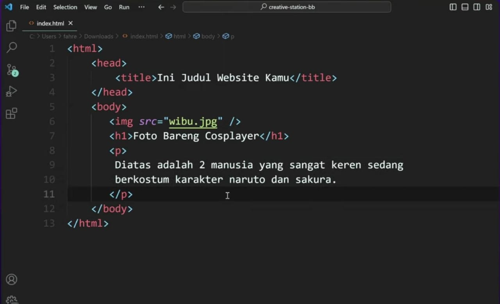

## Sejarah terciptanya web devoloper
Sejarah Terciptanya Web Developer yaitu pada tahun 1990 - an oleh seeorang insinyur bernama Tim Barnestly. Dia nyetir suatu konsep sistem yang memungkinkan sebuah dokumen bisa terhubung satu sama lain melalui internet. la juga nyiptain protokol http yang jadi jembatan antara server dan client untuk saling mengirim data , Jadi </http> ini yang jadi perantara atau jembatannya. Nah karena data yang dikirim berupa teks mentah kita tahu akan lebih mudah membaca dokumen yang di format makanya dia ciptain </html> sebagai bahasa untuk / simpelnya ngobromatin teks jadi lebih rapi dan lebih ter - struktur. Dia nyiptain browser pertama yang dikasih nama worldwipe atau </www>  , Jadi </http>  untuk transfer datanya dan nampilin datanya dan html untuk format datanya. 

## Apa itu HTML
HTML ibarat struktur tubuh manusia, `</html>` kayak tulang yg atur setiap bagian website yg akan kita buat. contoh sederhananya, setiap file HTML akan dianggap sebagai satu halaman/satu tubuh. setiap halaman akan dimulai dengan teks `<> </> `. Dalam tag HTML ini juga ada namanya head dan body dimana
1. Head 
	ini berfungsi nyimpen informasi yang dibutuhkan website simpelnya kayak judul yg muncul di Tab browser terus di dalamnya ada
2. Body 
	 Sebagai tempat komponen-komponen website dibuat kayak teks, heading, paragraf, gambar, tabel, link, dll. 
	 

Maka hasilnya juga sesuai ekspektasi bakal kaya gini 

Sebenarnya kita bisa styling setiap HTML ini kayak ganti background atau ganti ukuran, Semakin banyak tag dan stylingnya di HTML semakin berantakan juga kode yg kita buat, Makanya tahun 1994 diciptakan yg namanya styling sheet / CSS oleh pak hakon wiyung Lee, tujuannya  telling dan struktur htmlnya terpisah dan jadi lebih mudah untuk  dipelihara sampai saat ini. Styling ini sebenarnya sederhana. 