# Struktur HTML 
Struktur dasar HTML merupakan sebuah **case insensitive yang terdiri beberapa elemen yang membentuk suatu dokumen atau website**. Case-insensitive artinya tidak ada perbedaan antara huruf kapital dan huruf kecil, misalnya seperti 'P' dan 'p' yang keduanya dianggap sama.

 - Tag` <!DOCTYPE html>` memberitahukan web browser bahwa dokumen HTML adalah versi 5
- Tag pembuka `<html>` menandai awal sebuah dokumen HTML sampai dengan tag penutup `</html>` 
- Tag pembuka`<head>` berisi informasi tentang halaman HTML sampai dengan tag penutup `</head>` , biasanya dalam tag head terdapat tag `<title>` untuk memberikan informasi judul halaman HTML.
- Apapun tag yang berada di antara tag pembuka `<body>` sampai dengan tag penutup `</body>` akan tampil di web browser.

### Contoh
```html 
<!DOCTYPE html>
<html>
    <head>
        <title>ini adalah</title>
    </head>
    <body>
        <p>ini adalah paragraf yg akan ditampilkan di browser<h></p>
    </body>
</html>
```   

### Hasil
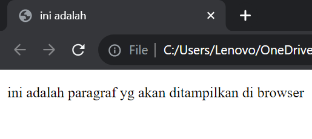 
# Anatomi Elemen HTML 
Elemen dalam HTML adalah sebuah **komponen yang menyusun dokumen HTML**. Elemen kadang juga disebut sebagai node, karena ia merupakan salah satu jenis node yang menyusun dokumen HTML dalam diagram HTML tree.

- `<a>` adalah tag pembuka 
- `<href>` adalah nama atribut 
- `<https://www.google.com>` nilai atribut 
- `<klik google>` isi tag/konten
- `<a>` tag penutup

### Contoh 
```html
<a href="https://www.google.com"> klik google ! </a>
``` 

### Hasil
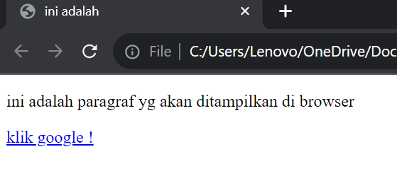

# Tag Dasar
## Heading 
Tag HTML yang digunakan untuk menunjukkan bagian penting pada halaman website dan memiliki enam tingkatan yang berurutan yaitu `H1` hingga `H6`.

```HTML
<!DOCTYPE html>

<html>

  <head>

    <title>ini adalah web</title>

  </head>

  <body>

    <h1>Teks sangat besar</h1>

    <h2>Teks lumayan besar</h2>

    <h3>Teks besar</h3>

    <h4>Teks kecil </h4>

    <h5>Teks lumayan kecil</h5>

    <h6>Teks sangat kecil</h6>

  </body>

</html>
```

### Penjelasan :
- Tag `<h1>` Digunakan untuk judul utama atau menjadikan teks sangat besar
- Tag `<h2>` Menunjukkan Teks menjadi lumayan besar
- Tag `<h3>` Menunjukkan teks menjadi besar 
- Tag `<h4>` Menunjukkan tingkatan judul yang lebih rendah atau menjadi kecil 
- Tag `<h5>` Menunjukkan tingkatan judul yang lebih rendah atau menjadi lumayan kecil 
- Tag `<h6>` Menunjukkan tingkatan judul yang lebih rendah atau menjadi sangat kecil

### Hasil :
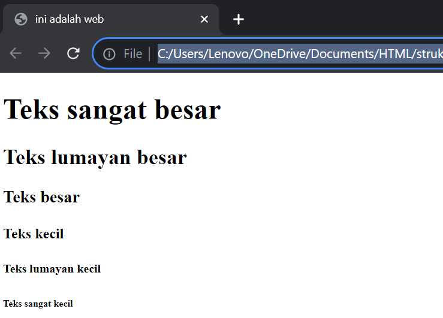
## Paragraf 
### Contoh
```HTML
<!DOCTYPE html>
<html>
  <head>
    <title>ini adalah judul</title>
  </head>
  <body>
    <p>Ini adalah tag paragraf</p>
    <p><b>Ini adalah tag bold</b></p>
    <p><u>Ini adalah tag garis bawah</u></p>
    <p><i>ini adalah teks miring</i></p>
    <P>ini adalah tag untuk <br> membuat baris baru </br>
  </body>
</html>
```
### Penjelasan
- Tag `<p>` digunakan agar kumpulan kalimat yang akan ditandai tiak bercampuran dengan paragraf yang lain, diakhiri dengan `</p>` penutup 
- Tag  `<b>` digunakan untuk membuat teks menjadi tebal / bold yang diakhiri dengan tag `</b>` 
-  Tag `<u>` digunakan untuk mengaris bawahi teks agar menonjolkan bagian tertentu dari teks diakhiri dengan tag penutup `</u>` 
-  Tag `<i>` digunakan untuk membuat teks miring untuk menekankan makna semantik dan diakhiri dengan tag `</i>` sebagai penutup
-  Tag `<br>` digunakann untuk membuat baris baru atau sering disebut yaitu membuat enter dan diakhiri dengan penutu `</br>` .
### Hasil
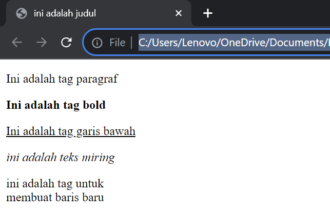
## Align
### Contoh
```html
<html>
  <head>
    <title>ini adalah judul</title>
  </head>
  <body>
   <h3>Belajar Menggunakan Elemen Tag Html</h3>
   <p align="left">
   Jika kamu hanya bertahan di zona nyaman, maka kamu tak akan pernah tahu banyak hal. Jangan takut mencoba!
   </p>
   <p align="right">
   Jangan kutuk dirimu atas kesalahan yang kamu buat di masa lalu, jadikan sebagai pelajaran dan berusaha hidup lebih baik.
   </p>
   <p align="center">
   Seburuk apapun masa lalumu, itu telah berlalu. Sekarang, fokus untuk kebahagiaan dirimu di masa depan.
   </p>
   <p align="justify">
   Ada dua tipe orang di dunia ini. Mereka yang mempunyai mimpi besar, dan mereka yang bangun untuk mewujudkannya.
   </p>
  </body>
</html>
```
### Penjelasan
`Atribut align` adalah atribut yang menentukan perataan teks. ada beberapa macam nilai atribut align sebagai berikut.
- `c  enter `: membuat seluruh teks ke tengah halaman web, penulisannya align=”center”
- `left `: membuat seluruh teks ke sisi kiri halaman web, penulisannya align=”left”
- `right `: membuat seluruh teks ke sisi kanan halaman web, penulisannya align=”right”
- `justify `: meregangkan baris sehingga setiap baris memiliki lebar yang sama (seperti dikoran dan majalah) penulisannya align=”justify”
### Hasil
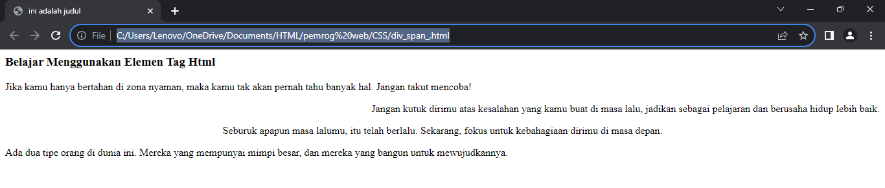
## Komentar
HTML juga menggunakan tag khusus untuk komentar. Untuk membuat komentar di HTML, kita juga menggunakan aw`alan `<!--` dan penutup `-->` 
### Contoh 
```HTML
<!--Ini komentar, tidak akan tampil di browser-->
<p>ini bukan komentar, dan akan tampil di browser</p>
```
### Penjelasan
-
### Hasil 
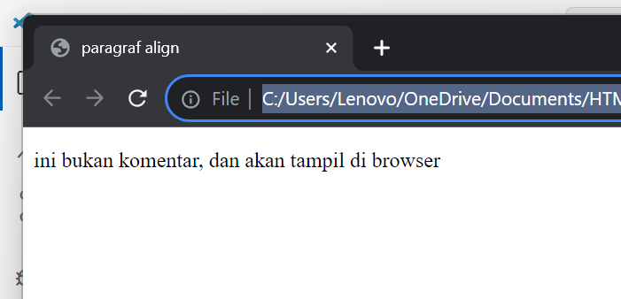
## List
List adalah fungsi dalam HTML yang digunakan untuk menampilkan daftar dari sesuatu. Dalam HTML, tag list terdiri dari 2 jenis, `<ol>` **ordered list (berurutan)** dan `<ul>` **unordered list (tidak berurutan)**. Ordered list akan ditampilkan dengan atau huruf, sedangkan unodered list dengan bulatan atau kotak ataupun simbol lainnya. 

> [!note] - List 
> untuk menampilkan list dalam HTML dapat menggunakan tag `<li>` ... `</li>` namun perlu dengan menyisipkan elemen `<ol>` ... `</ol>` atau `</ul>` ke dalam elemen `<li>` tersebut untuk membuat daftar list.

### Contoh
```HTML
<h1>Cara membuat kopi</h1>

        <p>Bahan-bahan</p>

        <ul>

            <li>2sdt kopi bubuk</li>

            <li>2sdt gula pasir</li>

            <li>air panas secukupnya</li>

        </ul>

        <p>langkah-langkah</p>

        <ol>

            <li>masukkan bubuk kopi dan gula ke dalam cangkir</li>

            <li>seduh dengan air panas mandidih</li>

            <li>aduk dan siap dihidangkan</li>

        </ol>
```

### Hasil
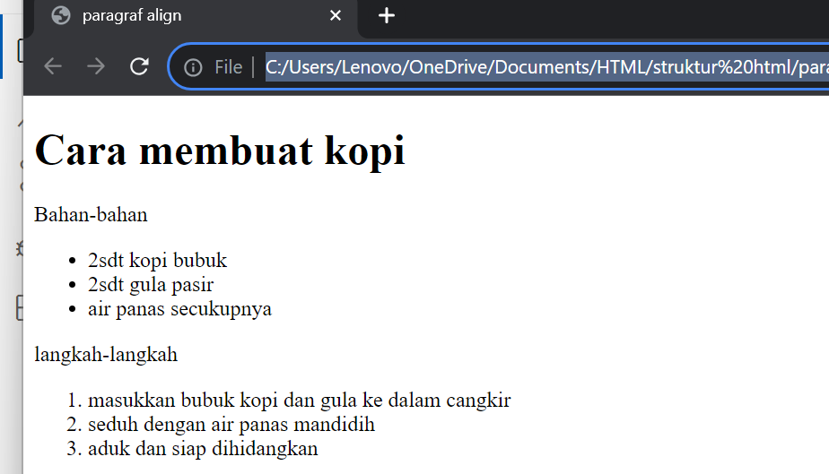

## Link
Link dapat ditemukan di hampir semua halaman web. Link/Tautan memungkinkan sebuah teks yang ketika di-klik akan pindah ke halaman lainnya. HTML menggunakan tag `<a>` untuk keperluan ini. Link ditulis dengan `<a>` yang merupakan singkatan cari anchor.

> [!note] - Tag
> Setiap tag `<a>` setidaknya memliki sebuah atribut `<href>` , Dimana `<href>` berisi alamat yang dituju. `<href>` adalah singkatan dari hypertext reference.

Atribut penting lainnya dari tag `<a>` adalah `<target>`. Atribut target menentukan tempat untuk membuka dokumen yang ditautkan. Atribut `<target>` memiliki beberapa nilai salah satunya `<_blank>` yang berfungsi untuk membuka tautan di tab baru.

### Contoh
```HTML

<a href="https://www.google.com" target="_blank">klik disini untuk ke google</a>
<a href="halaman_lain.html">klik disini untuk ke halaman lain yang saya buat!</a>
```

### Hasil
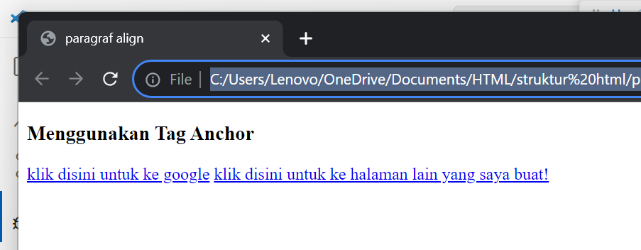
## Multimedia
### Gambar
Dalam HTML gambar didefinisikan dengan tag ``. Tag `` adalah tag kosong, hanya berisi atribut saja, dan tidak memiliki tag penutup.

> [!note] - Scr
> Atribut `<scr>` setidaknya mesti ada dalam tag ini untuk menemukan URL (alamat web) dari gambar yagn ingin ditampilkan.

Atribut `<alt>` menyediakan teks alternatif untuk gambar, jika pengguna karena beberapa alasan tidak dapat melihatnya (karena koneksi lambat, kesalahan pada atribut `<src>`, atau jika web browser telah disetting untuk tidak menampilkan gambar). Jika browser tidak dapat menemukan gambar, maka akan muncul nilai pada atribut alt.

Dalam tag `` terdapat juga atribut `<widht>` dan `<height>` untuk mengatur ukuran gambar, pada versi HTML5 standar satuan ukuran gambar adalah pixel. 

- Misalnya dalam folder root terdapat file gambar bernama logo.png. Untuk menampilkan gambar tersebut kita hanya perlu mengisi nama gambar beserta jenis ekstensi file gambar ke dalam atribut `<src>`, contohnya `src = "logo.png"`.

- Untuk menampilkan gambar dari internet carilah link gambar yang akan ditampilkan lalu masukkan dalam nilai atribut `<src>`, contohnya `https://namasitus.com/gambar.png`

### Contoh
```HTML 
<!DOCTYPE html>
<html>
    <head>
        <title>paragraf align</title>
    </head>
    <body>
        
    </body>
</html>
```

### Hasil
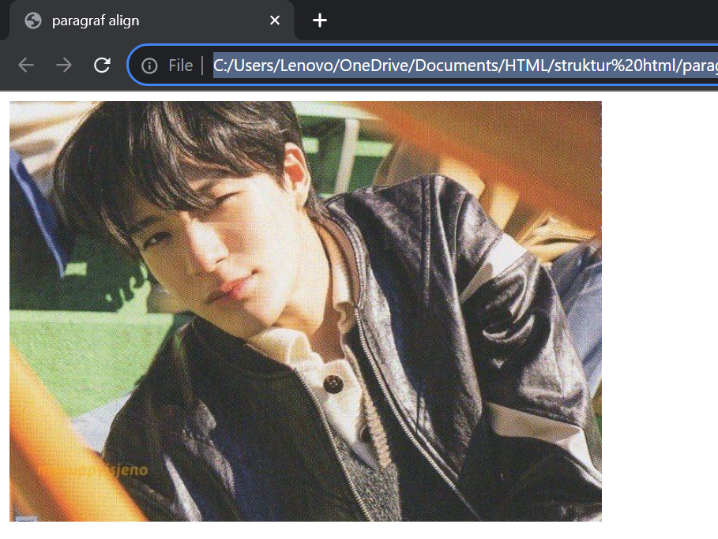

Berikut letak yang dimuat pada web diatas
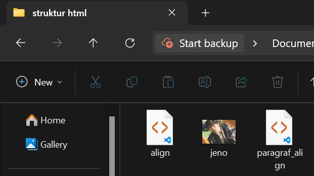

Gambar diatas adalah contoh gambar `<jeno>` yang berada di folder `<struktur html>` yang akan di tampilkan di web.
### Video
Fitur HTML5 mencakup dukungan audio dan video asli tanpa memerlukan Flash. Tag `<audio>` dan `<video>` pada HTML5 mempermudah penambahan media ke dalam halaman web. Yang penting untuk diatur pada tag ini adalah atribut `<src>` yang berfungsi untuk mengidentifikasi sumber media. Selain itu, terdapat pula atribut `<controls>` agar pengguna dapat memutar dan menjeda media.

### Contoh
```html
<!DOCTYPE html>
<html>
    <head>
        <title>video</title>
    </head>
    <body>
        <video src="praktek.mp4" width="300" height="200" controls>
        Browser anda tidak mendukung elemen <video>.
        </video>
    </body>
</html>
```

Konten berupa teks "Browser anda tidak mendukung elemen `<video>`." pada tag `<video>` akan ditampilkan jika browser tidak mendukung elemen tersebut. Sehingga sebenarnya bagian ini dapat dihilangkan.

### Hasil
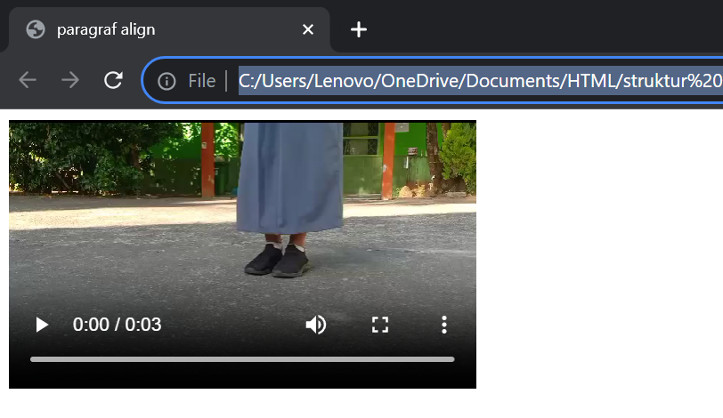

### Audio
Seperti yang telah dibahas sebelumnya bahwasanya tag `<audio>` merupakan bagian fitur HTML5 untuk menampilkan audio asli di halaman web tanpa memerlukan Flash sebagaimana pada HTML versi 4. Yang penting untuk diatur pada tag ini adalah atribut `<src>` yang berfungsi untuk mengidentifikasi sumber media. Selain itu, terdapat pula atribut `<controls>` agar pengguna dapat memutar dan menjeda media.

### Contoh
```HTML
<audio src="audio.wav" controls>
	browser anda tidak mendukung elemen </audio>.
</audio>
```

Konten berupa teks "Browser anda tidak mendukung elemen `<video>`. pada tag `<video>` aan ditampilkan jika browser tidak mendukung elemen tersebut. sehingga sebenarnya bagian ini dapat dihilangkan.

### Hasil
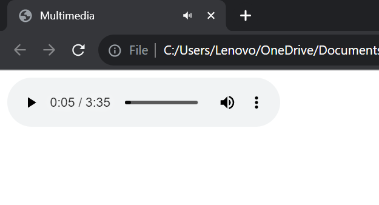

Berikut letak yang dimuat pada web diatas
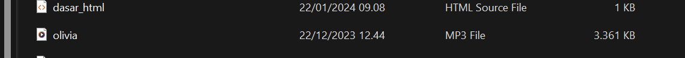

## Halaman web lain
Elemen `<iframe>` dapat digunakan untuk menampilkan halaman website lain dalam suatu website. Atau menampilkan dokumen HTML lain dalam sebuah website. Mudahnya, bisa dibilang _**website dalam website**_.

> [!note] - Iframe 
> Contohnya penggunaannya seperti ini. Jika kita mempunyai website sekolah, lalu di website tersebut ingin menampilkan alamat dalam google maps sekolah. Agar memudahkan pengunjung website, kita bisa langsung tampilkan saja halaman sekolah yang ada di goole maps.

Dalam tag `<iframe>` ada beberapa atribut yang penting seperti :
- `<src>`, untuk mencari sumber halaman html atau web yang akan ditambahkan di dalam frame.
- `<width>` dan `<height>`, untuk mengatur ukuran panjang dan lebar dari frame.

### Contoh
```HTML
<!DOCTYPE html>

<html>

  <head>

    <title>Halaman web lain</title>

  </head>

  <body>

    <iframe

      src="https://www.bilibili.tv/id/anime"

      width="800"

      height="500"

    ></iframe>

  </body>

</html>
```

### Hasil
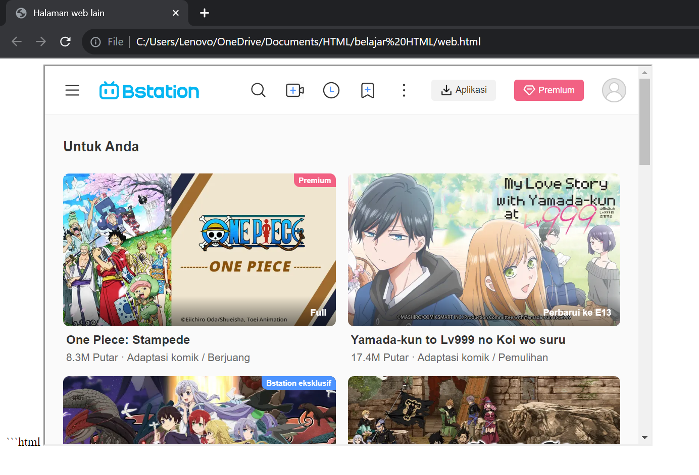
## Tabel
Table dalam HTML didefinisikan dengan tag `<tables>`.
- Setiap baris tabel didefinisikan dengan tag `<tr>`.
- Header (judul) tabel didefinisikan dengan tag `<th>`. Secara default, header tabel teks tebal dan berada di tengah.
- Data tabel/sel didefinisikan dengan tag `<td>`. Karena sel merupakan bagian terkecil dari tabel maka dari itu tag ini selalu berada di dalam tag `<tr>` 

Contoh :
``` HTML
<table border="1">
<tr>
	<th>nama</th>
	<th>asal institusi</th>
</tr>
<tr>
	<td>ibrahim mallombassang</td>
```

> [!note] - table
> perhatikan bahwa pada tag `<table>` terdapat sebuah atribut `<border>`.  Atribut `<border>` digunakan untuk memberikan nilai garis tepi dari table. Nilai ini dalam ukuran pixel. `<border="1">` berarti kita menginstrusikan kepada web browser bahwa tabel tersebut akan  memiliki garis tepi sebesar 1 pixel. Jika tidak ditambahkan, secara default tabel tidak memiliki garis tepi.

selain itu terdepat pula beberapa atribut tabel yang penting untuk diketahui yaitu:
- `<rowspan>` merupakan atribut HTML yang berfungsi untuk menggabungkan beberapa garis (ke bawah).
- `<colspan>` atau column span merupakan atribut HTML yang berfungsi untuk menggabungkan beberapa kolom (ke samping).
- `<width>` berfungsi untuk mengatur lebar tabel yang nilainya di definisikan dalam satuan pixel secara default.
- `<height>` berfungsi untuk mengatur tinggi tabel yang nilainnya didefinisikan dalam satuan pixel secara default.
- `<align>` berfungsi untuk mengatur perataan teks pada tabel, Nilai atribut yang dapat diberikan yaitu `<left>` untuk perataan teks ke kiri `<right>` untuk perataan teks ke kanan,dan `<center>` untuk pertaan teks ke tengah.
### Contoh
```HTML
<table border="1">

    <tr>

        <th rowspan="2">Nama</th>

        <th colspan="2">Asal Institusi</th>

    </tr>

    <tr>

        <th width="100">Sekolah</th>

        <th width="100">Kampus</th>

    </tr>

    <tr>

        <td>Nur Afni Ramadani</td>

        <td>SMKN 7 MAKASSAR</td>

        <td>Institut Teknologi Bandung</td>

    </tr>

    <tr>

        <td>Rafiazis</td>

        <td>SMAN 1 Bandung</td>

        <td>Institut Teknologi Bandung</td>

    </tr>

    <tr>

        <td>Jeno</td>

        <td>SMAN 1 MAKASSAR</td>

        <td>Universitas Indonesia</td>

    </tr>

</table>
```

### Hasil
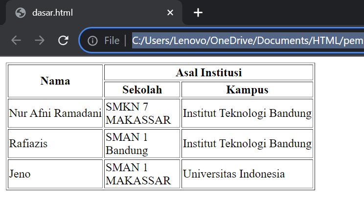

## Tabel 1
### Contoh 
```HTML
<html>

  <head>

    <title>table</title>

      </head>

        <body>

  <table border="1">

  <tr bgcolor="green">

  <th colspan="2" width="100">Nama Hari</th>

  <th colspan="2" width="100">Nama Bulan</th>

    </tr>

      <tr height="30">

        <td>Senin</td>

        <td>Selasa</td>

        <td>April</td>

          <td rowspan="2" align="center">Juni</td>

</tr>

    <tr height="30">

    <td>Rabu</td>

    <td>Kamis</td>

    <td>Mei</td>

</tr>

</table>

</body>

</html>
```

### Hasil
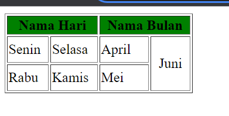

Analisis :
Untuk tabel `nama hari` dan `nama bulan` merupakan 2 kolom tetapi di tambahkan atribut `colspan` yang membuat 2 kolom menjadi 1.
Begitupun dengan kolom "juni" yang harusnya terdapat 2 baris tetapi di tambahkan atribut `rowspan` yang membuat 2 baris menjadi 1.
## Form
Elemen `<form>` HTML digunakan untuk mendefinisikan _form_ yang digunakan untuk mengumpulkan inputan dari pengguna _website_. Tag ini digunakan untuk mengkoleksi inputan dari user, konsep ini sama seperti konsep formulir di dunia nyata.

> [!note] - Form
> Dengan kata lain tag `<form>` merepresentasikan sebuah "formulir" di mana satu formulir bisa memiliki banyak kolom isian.

Form HTML berisikan elemen-elemen `form` lainnya. Elemen `<form>` digunakan untuk menampung macam-macam elemen yang berkaitan dengan sebuah `form`, seperti `text` `fields`, `checkbox`, `radio button`, tombol `submit`, dan banyak lagi yang dapat diedit kemudian ditulis untuk dikirim pada sebuah _server_ untuk selanjutnya diproses guna mendapatkan informasi tertentu dari atau untuk _user_.
Umumnya, sebuah _website_ selalu memiliki fitur _form_, contoh paling umum yang sering kita temui adalah seperti _form login, form sign up, form_ komentar di suatu _blog/media_.

### Input
Elemen `<input>` adalah elemen `form` yang paling penting. Elemen `<input>` dapat ditampilkan dalam beberapa cara, tergantung pada nilai atribut `type` yang digunakan. Request Berikut adalah beberapa contoh nilai dari atribut `type` :

- `text` digunakan untuk mengambil isian berupa teks. Contohnya seperti nama.
- `password` digunakan untuk mengambil isian berupa **kata sandi** atau sesuatu yang bersifat rahasia. Tipe ini akan mengubah semua karakter yang diketikkan ke dalam karakter bulat.
- `radio` digunakan sebagai kolom isian bertipe **pilihan** yang menawarkan beberapaopsi kepada user namun tetapi hanya satu opsi saja yang boleh dipilih. Contohnya seperti jenis kelamin atau agama.

> [!note] - Radio & name 
> Perlu diperhatikan bahwa untuk penggunaan tipe `radio` yang berkategori set pilihan yang sama mengharuskan nilai `name` nya juga sama.
Opsi default dapat dilakukan dengan menambahkan atribut checked pada elemen opsi yang dijadikan sebagai opsi default.

- `checkbox` digunakan untuk memberikan *daftar pilihan dalam satu set opsi*. User dapat memilih satu atau bahkan lebih dari satu pilihan pada tipe ini. Hal ini berbeda dengan tipe sebelumnya yaitu `radio` yang hanya memungkinkan user untuk memilih satu  pilihan saja. Contoh penggunaan `checkbox` seperti daftar makanan kesukaan, daftar olahraga yang tidak disukai, dan yang semisalnya.

> [!note] - Checkbox & name
> Perlu diperhatikan bahwa untuk penggunaan tipe `checkbox` yang berkategori set pilihan yang sama mengharuskan nilai `name` -nya juga sama.

- `Number` digunakan untuk membatasi isian user hanya pada karakter numerik saja. Browser akan menambahkan dua buah tombol atas dan bawah untuk mengubah angka isian.

Beberapa atribut untuk tipe number :
- `min` - menentukan angka minimal
- `max` - menentukan angka maksimal
- `step` - smenentukan kelipatan (nilai yang tidak sesuai kelipatan tidak bisa di-input, dan default dari atribut ini adalah `1`)

- `Date` digunakan untuk memberikan isian berupa tanggal. Atribut `min` dan `max` dapat pula difungsikan pada tipe ini untuk mengatur tanggal minimal dan tanggal maksimal yang diinginkan. Nilai `min` dan `max` tersebut ditulis dengan format: `YYYY-mm-dd`.

- `File` digunakan untuk memungkinkan pengguna memuat file. Atribut `accept` juga dapat disisipkan pada tipe ini dengan maksud untuk mengatur file apa saja yang boleh di-upload. Beberapa contoh value dari atribut `accept` yaitu:

- `accept-"image/png,inage/jpg.Image/jpeg` - untuk file gambar seperti `png`, `jpg`, atau `jpeg`
- `accept="pdf"` - untuk file pdf
- `accept="pdf"` - untuk file pdf
- `accept-".doc, docx"` - untuk file `doc` atau `docx`
- `accept-".ppt, pptx"` - untuk file `ppt` atau `pptx`

- `submit` ditampilkan dalam bentuk tombol untuk mengirim data pada `<form>` yang menjadi pembungkusnya. Atribut `value` digunakan untuk mengisi teks yang ingin ditampilkan pada tombol.

- `reset` berguna untuk *mengembalikan state (keadaan) atau data dari suatu form ke nilai awalnya*. Jika nilai awal sebuah input adalah kosong, maka ketika direset ia akan kembali kosong. Tapi jika nilai awalnya sudah terisi sesuatu, maka ketika direset datanya akan kembali seperti yang sudah diset sebelumnya.

- `button` berguna untuk membuat inputan berupa sebuah tombol. Tombol ini nantinya bisa difungsikan sesuai dengan keinginan dari pengembang web.

### Label
Elemen `<label>` memiliki fungsi khusus untuk melabeli sebuah kolom inputan. Ketika screen reader membaca konten halaman HTML, lalu menemukan sebuah inputan, ia akan membaca label yang bersangkutan. 
Fungsi lain dari tag `<label>` adalah ketika kita mengklik label, maka browser akan meletakkan fokus pada kolom isian yang terhubung dengannya. Syarat yang perlu diperhatikan yaitu dengan menghubungkan sebuah `<label>` dan `<input>` dengan atribut `for` untuk `label`, dan atribut `id` pada `<input>` dengan nilai untuk kedua atribut tersebut mesti sama persis.

### Select
Elemen `<select>` berguna dalam mendefinisikan sebuah tombol dropdown yang dimana user dapat memilih salah satu dari banyak pilihan.

> [!note] - Select 
> Elemen `<select>` nantinya berperan sebagai kontainer atau pembungkus dari elemen `<option>` yang berperan sebagai daftar pilihan atau opsi. 

 Elemen `<select>` hampir mirip fungsinya dengan `<input type ="radio">` akan tetapi baiknya elemen `<select>` digunakan untuk memilih satu pilihan yang terdapat banyak opsi di dalamnya, sedangkan `<input type ="radio">` lebih baiknya untuk digunakan jika user diarahkan memilih hanya satu pilihan yang opsi pilihannya tidak terlalu banyak. Contoh penggunaan elemen ini seperti memasukkan pilihan berupa asal daerah atau yang semisalnya.
 
Penting untuk diketahui bahwasanya opsi yang aktif secara default adalah adalah opsi yang pertama. Akan tetapi, kita bisa mengatur opsi mana yang aktif secara default dengan menambahkan atribut selected pada suatu `<option>` yang ingin dijadikan sebagai opsi default.

### Text Area
Elemen `<textarea>` berguna untuk mengambil inputan user berupa teks yang dapat memuat lebih dari satu baris. Jika dibandingkan dengan elemen `<input>` teks biasa, elemen `<textarea>` memiliki ukuran tinggi yang lebih besar. Element `<textarea>` bisa diisi lebih dari satu baris dengan menekan enter.

Atribut yang dapat digunakan untuk mengatur kuran dari textarea yaitu rows untuk jumlah baris, sedangkan atribut cols untuk lebarnya.

### Button
Elemen `<button>` yang berada di dalam sebuah `form` akan otomatis dianggap sama fungsinya seperti `<input type="submit">`. Jika ingin membuat tombol biasa yang tidak men-submit `<form>` dapat dilakukan dengan menambahkan atribut `type="button"`.

Contoh :
```HTML
<h1>Formulir Pendaftaran</h1>
<form action="">
    <div>
      <label for="nama-lengkap"><b>Nama Lengkap:</b></label><br>
      <input type="text" id="nama-lengkap" name="nama_lengkap" placeholder="Masukkan nama lengkap" required>
     </div>

     <div>
       <label for="password"><b>Password:</b></label><br>
       <input type="password" id="password" name="password" placeholder="Masukkan password" required>
      </div>

      <div>
        <b>Jenis Kelamin:</b><br>
        <input id="lk" type="radio" name="jenis_kelamin" checked>
        <label for="lk">Laki-Laki</label>

        <input id="pr" type="radio" name="jenis_kelamin">
        <label for="pr">Perempuan</label>
      </div>

      <div>
        <label for="isian-usia"><b>Usia:</b></label><br>
        <input type="number" id="isian-usia" name="usia" min="17" max="25" value="19" required> Tahun
      </div>

      <div>
         <label for="tgl-ijazah"><b>Tanggal Ijazah:</b></label> <br>
         <input type="date" id="tgl-ijazah" name="tgl_ijazah" min="2021-01-01" value="2023-06-20" required>
      </div>

      <div>
         <label for="opsi-agama"><b>Agama:</b></label><br>
         <select id="opsi-agama" name="agama" required>
           <option disabled>---Pilih Agama----</option>
           <option value="islam">Islam</option>
           <option value="kristen">Kristen</option>
           <option value="katolik">Katolik</option>
           <option value="hindu">Hindu</option>
           <option value="buddha">Buddha</option>
           <option value="atheis" disabled>Atheis</option>
          </select>
       </div>

       <div>
          <label for="alamat"><b>Alamat:</b></label> <br>
          <textarea id="alamat" name="alamat" cols="25" rows="5" placeholder="Harap masukkan alamat secara lengkap" required></textarea>
       </div>

       <div>
          <b>Kemampuan Berbahasa Asing:*</b><br>
	        <input type="checkbox" id="inggris" name="bahasa_asing">
	        <label for="inggris">Inggris</label>

          <input type="checkbox" id="arab" name="bahasa_asing">
          <label for="arab">Arab</label>
                
          <input type="checkbox" id="jepang" name="bahasa_asing">
          <label for="jepang">Jepang</label>
       </div>

       <div>
          <label for="isian-foto"><b>Foto 4x6:*</b></label><br>
          <input type="file" id="isian-foto" name="foto" accept="image/png,image/jpg,image/jpeg">
       </div>

       <br>
       <input type="submit" value="Kirim">
       <input type="reset" value="Batal">
       <i>*opsional (tidak wajib diisi)</i>
</form>
```

Hasil :
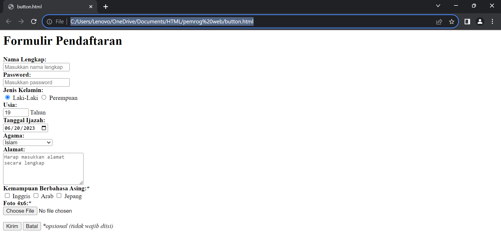

Beberapa atribut yang digunakan pada contoh di atas yang perlu untuk diperjelas yaitu sebagai berikut:
- `name` - digunakan sebagai nama variabel yang akan diproses oleh web server (contoh menggunakan PHP).
- `required` - digunakan untuk memastikan bahwa pengguna harus memasukkan nilai pada input tersebut sebelum dapat melakukan proses submit formulir.
- `placeholder` - menuliskan teks pada elemen input. Placeholder sangat bermanfaat untuk memberikan teks bantuan kepada user untuk inputan _form_ yang kompleks.
- `value` - menentukan nilai awal dari sebuah elemen input.
- `disabled` - digunakan untuk menonaktifkan inputan pada elemen yang diberi atribut ini.

### *Bagaimana Cara Memproses Form?*

Ketika sebuah `<form>` disubmit, baik menggunakan elemen `<button>` mau pun `<input type="submit">`, browser akan mengirimkan data tersebut kepada URL yang didefinisikan pada atribut action di dalam tag form.
Ada pun jika atribut action tidak didefinisikan, maka browser akan menggunakan URL sekarang sebagai tujuan pengiriman data.

Contoh :
```HTML
<form action*="/proses-pendaftaran"*> </form>
```

Pada contoh di atas, ketika form di-submit, browser akan mengirimkan data yang ada  menuju URL /proses-pendaftaran.

**Apa yang terjadi pada URL /proses-pendaftaran?**

Pada URL tersebut terdapat sebuah aplikasi/program yang berjalan di server (bukan di browser). Tugas dari program tersebut adalah mengelola data yang dikirim seperti misalnya menyimpan data tersebut ke dalam sebuah database.
Bahasa yang umum digunakan di dalam server adalah python, nodejs, PHP, dan lain sebagainya.
Untuk mendapatkan gambaran lebih jelas, sebenarnya akan dijelaskan pada modul selanjutnya yang berkaitan dengan materi PHP atau juga bisa dengan membaca tutorial berikut :

```
https://jagongoding.com/web/php/web-dinamis/membuat-dan-menangani-form/https://jagongoding.com/web/php/web-dinamis/membuat-dan-menangani-form/
```

# Latihan Form & HTML
## Form
### Contoh
 ```HTML
 <form>
     <label for="nama"> nama : </label>
     <input type="text" id="nama" required />
     <br />
     <br />
     <label for="kata_sandi">kata sandi : </label>
     <input type="kata_sandi" />
     <br />
     <br />
     Jenis Kelamin :
     <input type="radio" name="jk" />
     <label>laki-laki</label>
     <input type="radio" name="jk" />
     <label>perempuan</label>
     <br />
     <br />
     <label>Bahasa pemrograman yang dikuasai :</label>
     <br />
     <input type="checkbox" name="coding" />
     <label>coding</label>
     <input type="checkbox" name="web" />
     <label>destop</label>
     <br />
     <br />
     <input type="submit" value="kirim"/>
     <input type="submit" value="reset"/>
</form>
```
### Analisis
- `<input type="text" id="nama" required />` digunakan untuk memasukkan teks. Atribut `id="nama"` digunakan untuk mengidentifikasi input ini, dan atribut `required` menandakan bahwa input ini harus diisi sebelum form dapat dikirim.
- `<input type="kata_sandi" />` seharusnya diganti menjadi `<input type="password" />` untuk menghasilkan inputan kata sandi yang tersembunyi.
- Terdapat dua elemen `<input type="radio" />` yang memiliki atribut `name="jk"`, yang berarti hanya satu opsi dari kedua radio button tersebut yang dapat dipilih. Namun, elemen tersebut tidak memiliki atribut `value` yang dibutuhkan untuk menentukan nilai yang dikirimkan ke server saat form dikirim.
- Terdapat dua elemen `<input type="checkbox" />` yang memiliki atribut `name` yang berbeda, yaitu `"coding"` dan `"web"`. Ini berarti pengguna dapat memilih lebih dari satu opsi yang tersedia.
- `<input type="submit" value="kirim"/>` adalah tombol submit yang akan mengirimkan data form ke server ketika diklik.
- `<input type="submit" value="reset"/>` adalah tombol reset yang akan menghapus semua inputan form ketika diklik.
### Hasil
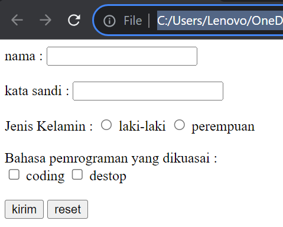
## Tabel 
### Contoh
```html
<html>
  <head>
    <title>table</title>
      </head>
        <body>
  <table border="1">
  <tr bgcolor="green">
  <th colspan="2" width="100">Nama Hari</th>
  <th colspan="2" width="100">Nama Bulan</th>
    </tr>
      <tr height="30">
        <td>Senin</td>
        <td>Selasa</td>
        <td>April</td>
          <td rowspan="2" align="center">Juni</td>
</tr>
    <tr height="30">
    <td>Rabu</td>
    <td>Kamis</td>
    <td>Mei</td>
</tr>
</table>
</body>
</html>
```
### Analisis
1. Di dalam tag `<head>`, terdapat tag `<title>` yang berfungsi untuk memberikan judul halaman, yaitu "table".
2. Di dalam tag `<body>`, terdapat sebuah tabel yang dibuat menggunakan tag `<table>`. Atribut `border="1"` digunakan untuk memberikan garis tepi pada tabel dengan ketebalan 1 piksel.
3. Terdapat beberapa baris tabel yang dibuat menggunakan tag `<tr>`. Baris pertama memiliki atribut `bgcolor="green"` yang memberikan warna latar belakang hijau pada baris tersebut.
4. Di dalam baris pertama, terdapat empat sel tabel yang dibuat menggunakan tag `<th>`. Atribut `colspan="2"` digunakan untuk menggabungkan dua kolom menjadi satu pada setiap sel. Atribut `width="100"` digunakan untuk mengatur lebar setiap sel menjadi 100 piksel.
5. Di dalam baris kedua, terdapat empat sel tabel yang dibuat menggunakan tag `<td>`. Atribut `height="30"` digunakan untuk mengatur tinggi setiap sel menjadi 30 piksel.
6. Pada sel ketiga baris kedua, terdapat atribut `rowspan="2"` yang menyebabkan sel tersebut menggabungkan dua baris vertikal.
7. Beberapa teks seperti "Senin", "Selasa", "April", dan "Mei" ditempatkan di dalam sel-sel tabel menggunakan tag `<td>`. Sel "Juni" pada kolom bulan memiliki atribut `align="center"` untuk mengatur teks menjadi tengah.
8. Setelah tabel selesai, diakhiri dengan tag `</table>`.
### Hasil

# DIV & SPAN
## DIV
`<div>` adalah tag HTML yang digunakan untuk membuat blok konten. Tag ini digunakan untuk mengelompokkan konten dan memberikan atribut tertentu pada blok tersebut.
### Contoh 
```html
<!DOCTYPE html>
<html>
<head>
    <title>DIV SPAN</title>
</head>
<body>
    <!-- div digunakan untuk memblok satu area dengan tanda baris
    baru setelahnya-->
    <div> ini dibuat menggunakan div </div>
    <div> ini juga menggunakan div</div>
</body>
</html>

```

### Hasil 
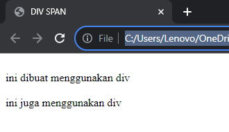
## SPAN
`<span>` adalah tag HTML yang digunakan untuk membuat blok konten yang tidak memiliki atribut tertentu.
### Contoh
```html
<!DOCTYPE html>
<html>
<head>
    <title>DIV SPAN</title>
</head>
<body>
    <!-- kebalikan <div>-->
    <span> ini digunakan untuk span</span>
    <span> ini juga menggunakan span </span>
</body>
</html>
```
### Hasil
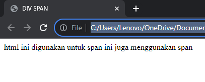


